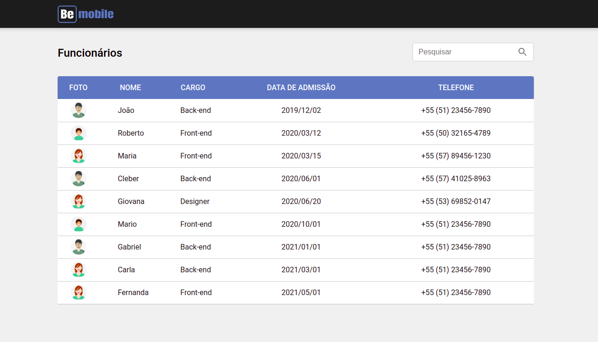

<div align="center">
<hr>


<hr>

### Tecnologias utilizadas


 


 


 


</div>

#### Sobre
- Uma aplicação que com o axios pega de um json-server dados de usuários e mostra em formato de tabela, possuindo também uma busca dinâmica por nome do usuário.
- Aplicação web desenvolvida para a seletiva de emprego da BeMobile.


#### Pré-requisitos

- Instale o [Git](https://git-scm.com/)
- Instale o [NodeJs](https://nodejs.org/pt-br/)
- Instale o [Yarn](https://yarnpkg.com/)

#### Executando a aplicação
1. Faça um git clone do repositório: 
- - ``` git clone https://github.com/edinelsonslima/bemobile.git```

2. Abra um terminal dentro da pasta do projeto e execute: 
- - ``` yarn ```

3. Execute a aplicação: 
- - ``` yarn dev```

4. No seu navegador acesse a url: 
- - ``` http://localhost:3001```